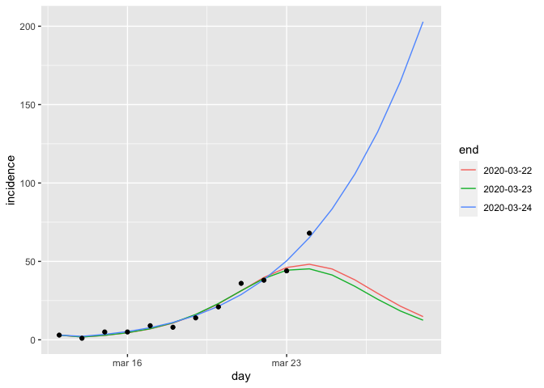
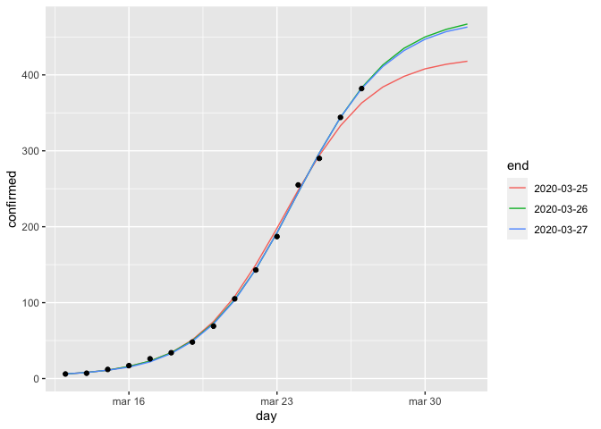

Simple forecasts
================

Modelis paremtas šituo
[straipsniu](https://bmcmedicine.biomedcentral.com/articles/10.1186/s12916-019-1406-6).
Modeliuojamas užsikrėtusių per dieną skaičius.

Duomenys modeliavimui

    ##           day confirmed incidence times
    ## 1  2020-03-13         6         3    15
    ## 2  2020-03-14         7         1    16
    ## 3  2020-03-15        12         5    17
    ## 4  2020-03-16        17         5    18
    ## 5  2020-03-17        26         9    19
    ## 6  2020-03-18        34         8    20
    ## 7  2020-03-19        48        14    21
    ## 8  2020-03-20        69        21    22
    ## 9  2020-03-21       105        36    23
    ## 10 2020-03-22       143        38    24
    ## 11 2020-03-23       187        44    25
    ## 12 2020-03-24       255        68    26
    ## 13 2020-03-25       290        35    27
    ## 14 2020-03-26       344        54    28

Sugeneruoti trys modeliai, numetant po vieną dieną nuo visos imties.
Kiekvienam modeliui suskaičiuota 10 dienų prognozė.

Juoda spalva SAM skelbti užsikrėtusių per dieną skaičiai.
<!-- -->

Viso atvejų

<!-- -->

Prognozių lentelė.

    ##           day 2020-03-24 2020-03-25 2020-03-26 historic
    ## 1  2020-03-13          3          3          3        3
    ## 2  2020-03-14          2          2          2        1
    ## 3  2020-03-15          3          3          3        5
    ## 4  2020-03-16          5          5          5        5
    ## 5  2020-03-17          8          7          7        9
    ## 6  2020-03-18         11         11         11        8
    ## 7  2020-03-19         16         17         16       14
    ## 8  2020-03-20         21         24         23       21
    ## 9  2020-03-21         29         33         31       36
    ## 10 2020-03-22         38         42         40       38
    ## 11 2020-03-23         50         48         48       44
    ## 12 2020-03-24         65         50         53       68
    ## 13 2020-03-25         83         46         52       35
    ## 14 2020-03-26        106         39         47       54
    ## 15 2020-03-27        133         30         39       NA
    ## 16 2020-03-28        165         21         30       NA
    ## 17 2020-03-29        203         14         22       NA
    ## 18 2020-03-30        248         10         15       NA
    ## 19 2020-03-31        301          6         10       NA
    ## 20 2020-04-01        362          4          7       NA
    ## 21 2020-04-02        434          2          4       NA
    ## 22 2020-04-03        516          2          3       NA
    ## 23 2020-04-04        610          1          2       NA
    ## 24 2020-04-05        718          1          1       NA

Viso atvejų

    ## # A tibble: 24 x 5
    ##    day        `2020-03-24` `2020-03-25` `2020-03-26` historic
    ##    <date>            <dbl>        <dbl>        <dbl>    <int>
    ##  1 2020-03-13            6            6            6        6
    ##  2 2020-03-14            8            8            8        7
    ##  3 2020-03-15           11           11           11       12
    ##  4 2020-03-16           16           16           16       17
    ##  5 2020-03-17           24           23           23       26
    ##  6 2020-03-18           35           34           34       34
    ##  7 2020-03-19           51           51           50       48
    ##  8 2020-03-20           72           75           73       69
    ##  9 2020-03-21          101          108          104      105
    ## 10 2020-03-22          139          150          144      143
    ## # … with 14 more rows

Modelių koeficentai. Eksponentinis augimas yra p = 1. K yra suminis visų
atvejų skaičius.

    ##       r     p      K
    ## 1 0.684 0.846 330000
    ## 2 0.479 1.000    422
    ## 3 0.487 0.986    475
