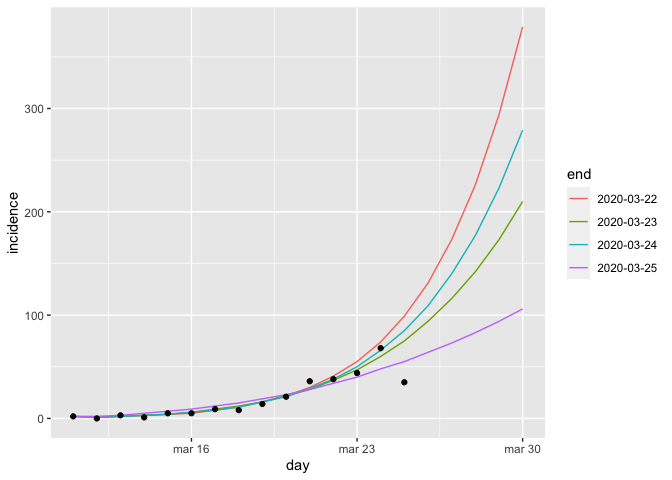
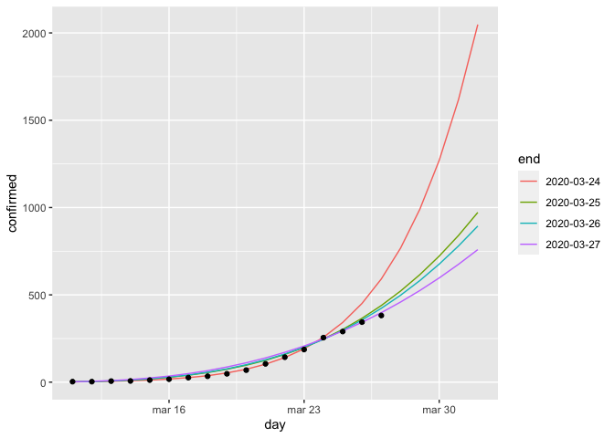
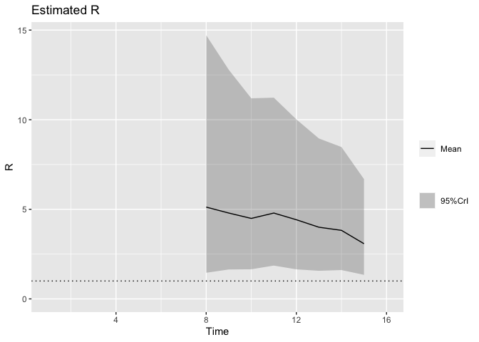
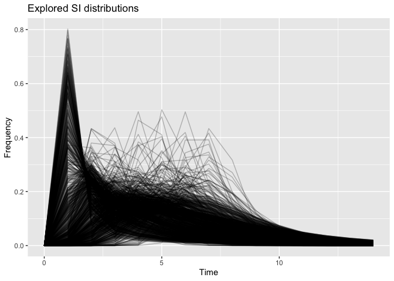

Apibendrintas augimo modelis
================

Modelis paremtas šituo
[straipsniu](https://www.sciencedirect.com/science/article/pii/S1755436516000037).
Modeliuojamas užsikrėtusių per dieną skaičius.

Duomenys modeliavimui

    ##           day confirmed incidence times w
    ## 1  2020-03-11         3         2    13 1
    ## 2  2020-03-12         3         0    14 0
    ## 3  2020-03-13         6         3    15 1
    ## 4  2020-03-14         7         1    16 1
    ## 5  2020-03-15        12         5    17 1
    ## 6  2020-03-16        17         5    18 1
    ## 7  2020-03-17        26         9    19 1
    ## 8  2020-03-18        34         8    20 1
    ## 9  2020-03-19        48        14    21 1
    ## 10 2020-03-20        69        21    22 1
    ## 11 2020-03-21       105        36    23 1
    ## 12 2020-03-22       143        38    24 1
    ## 13 2020-03-23       187        44    25 1
    ## 14 2020-03-24       255        68    26 1
    ## 15 2020-03-25       290        35    27 1

Sugeneruoti keturi modeliai, numetant po vieną dieną nuo visos imties.
Kiekvienam modeliui suskaičiuota 10 dienų prognozė.

Juoda spalva SAM skelbti užsikrėtusių per dieną skaičiai.
<!-- -->

Viso atvejų

<!-- -->

Prognozių lentelė.

    ##           day 2020-03-23 2020-03-24 2020-03-25 historic
    ## 1  2020-03-11          2          2          2        2
    ## 2  2020-03-12          1          1          2        0
    ## 3  2020-03-13          2          2          3        3
    ## 4  2020-03-14          3          3          5        1
    ## 5  2020-03-15          4          4          7        5
    ## 6  2020-03-16          6          6          9        5
    ## 7  2020-03-17          9          8         12        9
    ## 8  2020-03-18         12         11         15        8
    ## 9  2020-03-19         16         16         19       14
    ## 10 2020-03-20         22         21         23       21
    ## 11 2020-03-21         28         29         28       36
    ## 12 2020-03-22         37         38         34       38
    ## 13 2020-03-23         47         50         40       44
    ## 14 2020-03-24         60         66         48       68
    ## 15 2020-03-25         75         85         55       35
    ## 16 2020-03-26         94        109         64       NA
    ## 17 2020-03-27        116        140         73       NA
    ## 18 2020-03-28        142        177         83       NA
    ## 19 2020-03-29        173        223         94       NA
    ## 20 2020-03-30        210        279        106       NA
    ## 21 2020-03-31        252        348        118       NA
    ## 22 2020-04-01        302        430        132       NA
    ## 23 2020-04-02        360        530        147       NA
    ## 24 2020-04-03        426        649        162       NA
    ## 25 2020-04-04        502        791        179       NA

Viso atvejų

    ## # A tibble: 25 x 5
    ##    day        `2020-03-23` `2020-03-24` `2020-03-25` historic
    ##    <date>            <dbl>        <dbl>        <dbl>    <int>
    ##  1 2020-03-11            2            2            2        3
    ##  2 2020-03-12            3            3            4        3
    ##  3 2020-03-13            5            5            7        6
    ##  4 2020-03-14            8            8           12        7
    ##  5 2020-03-15           12           12           19       12
    ##  6 2020-03-16           18           18           28       17
    ##  7 2020-03-17           27           26           40       26
    ##  8 2020-03-18           39           37           55       34
    ##  9 2020-03-19           55           53           74       48
    ## 10 2020-03-20           77           74           97       69
    ## # … with 15 more rows

Modelių koeficentai. Eksponentinis augimas yra p = 1. K yra suminis visų
atvejų skaičius.

    ##       r     p
    ## 1 0.489 0.921
    ## 2 0.595 0.855
    ## 3 0.527 0.893
    ## 4 0.920 0.729

Savaitinis R įvertis. R\<1 reiškia kad epidemija perėjo į kritimą.
Daryta pagal šitą
[straipsnį](https://www.ncbi.nlm.nih.gov/pmc/articles/PMC3816335/) su R
paketu
[EpiEstim](https://cran.r-project.org/web/packages/EpiEstim/index.html).
Daryta pagal pavyzdį iš šio
[blogo](https://timchurches.github.io/blog/posts/2020-02-18-analysing-covid-19-2019-ncov-outbreak-data-with-r-part-1/#fitting-an-sir-model-to-the-hubei-province-data).

<!-- -->

Ta pati informacija lentelėje

    ##   t_start t_end  Mean(R)   Std(R)
    ## 1       2     8 5.012818 3.555581
    ## 2       3     9 4.696936 2.981451
    ## 3       4    10 4.404239 2.554642
    ## 4       5    11 4.698566 2.533153
    ## 5       6    12 4.330686 2.295299
    ## 6       7    13 3.925522 2.043279
    ## 7       8    14 3.757929 1.885073
    ## 8       9    15 3.025173 1.456956

[Serijiniai intervalai](https://en.wikipedia.org/wiki/Serial_interval)
(intervalai tarp užsikrėtimų)

<!-- -->
